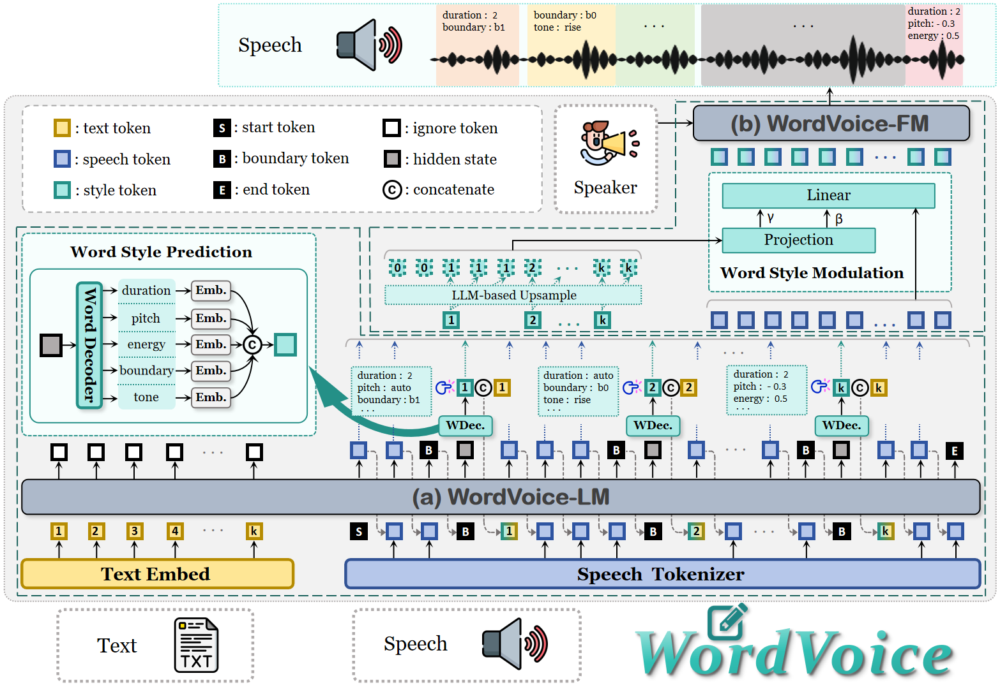

# WordVoice Model 🚀

<div align="center">

[](#)
[](https://xxh333.github.io/wordvoice-demo/)
[](https://github.com/XXH333/WordVoice-5A-Pipeline)
[](https://huggingface.co/datasets/XXH333/WordVoice-5A)
[](https://huggingface.co/XXH333/WordVoice-base-0.5B)
[](https://www.python.org/)
[](LICENSE)


**WordVoice 官方模型实现：基于 CosyVoice3 框架的字级别显式与解耦多维控制 TTS**

</div>

---

<div align="center">

# 🌏 Language

**🇨🇳 中文 | EN English**

[跳转到中文](#cn-中文说明) ｜ [Jump to English](#en-english-demonstration)

</div>

---

# 🇨🇳 中文说明

## 📖 简介 (Overview)

**WordVoice** 是一个突破现有 LLM-TTS 粗粒度控制瓶颈的全新语音生成框架。它将传统的“隐式端到端生成”转化为“显式、高可控”的生成范式，特别适用于需要精准情感表达和严格时间对齐的场景（如：有声书配音、视频译制等）。

本仓库包含了 WordVoice 模型的**训练**与**推理**代码。基于我们开源的 [WordVoice-5A 数据集](https://huggingface.co/datasets/XXH333/WordVoice-5A) 及语言学 [字级属性标注 Pipeline](https://github.com/XXH333/WordVoice-5A-Pipeline)，本模型实现了对语音生成过程中**五个声学维度**的字级别精准解耦控制。

---

## ✨ 核心特性 (Features)

### 🎯 显式字级多维控制 (Explicit Word-Level Control)
支持对每个输入字的五个声学属性进行独立、解耦的控制：
- ⏱️ **时长 (Duration)**：字级发音时长
- ⏸️ **边界 (Boundary)**：五级停顿分类（`b0`–`b4`）
- 🔊 **能量 (Energy)**：字级音量大小（`0`–`1`）
- 🎵 **音高 (Pitch)**：字级核心基频高低（`-1`–`1`）
- 📈 **音调 (Tone)**：七大类韵律形态（平、升、强升、降、强降、峰、谷）

### 🧠 “声学思考”机制 (Acoustic Thinking via Bound-Token)
在自回归（AR）语言模型中采用 `bound-token` ($\langle b \rangle$) 机制。模型在生成某个字对应的语音 token 前，会先显式预测该字的声学属性，实现“先规划韵律，再生成声音”的智能过程。

### 🎛️ 细粒度声学调制 (Fine-Grained Acoustic Modulation)
在 Flow Matching (FM) 阶段，引入基于 LLM 的字级风格 token 上采样与细粒度条件调制模块，弥补了离散 token 带来的声学细节丢失，确保了极高的波形重建保真度与控制精度。

### 🔄 双模式推理 (Dual Inference Modes)
- **自由模式 (Free Mode)**：由 LLM 自动进行多任务韵律规划，生成自然流畅的零样本 (Zero-shot) 语音。
- **控制模式 (Control Mode)**：用户可手动介入，直接指定某个特定字的声学属性（如：强制拉长某个字、提高音调等），实现高度确定性的风格干预。

---

## 🛠️ 安装指南 (Installation)

我们推荐使用 **Conda** 来管理 Python 环境。

### 1. 创建并激活虚拟环境
```bash
conda create -n wordvoice python=3.10 -y
conda activate wordvoice
```

### 2. 拷贝源码
```bash
git clone https://github.com/XXH333/WordVoice-main.git

cd WordVoice-main
```

### 3. 安装依赖
本项目使用 `pyproject.toml` 管理依赖项。请在项目根目录下运行以下命令进行自动安装：

```bash
pip install -e . -i https://mirrors.aliyun.com/pypi/simple/ --trusted-host=mirrors.aliyun.com
```

安装其他依赖项

```bash
pip install num2words==0.5.14 x_transformers==2.11.24
```

## 📥 下载预训练模型 (Download Models)
运行以下脚本，自动下载 [WordVoice 预训练模型权重](https://huggingface.co/XXH333/WordVoice-base-0.5B)及相关依赖模型（如 CosyVoice3、MMS-FA 等）：
```bash
bash download_models.sh
```
*运行完 `download_models.sh` 脚本后，WordVoice 的预训练模型权重及相关依赖项（如 LLM 基座、Flow Matching 权重等）将默认下载并保存在项目根目录下的 `checkpoints/` 文件夹中。在进行后续的推理或训练时，代码默认会从该路径加载模型。


## 🚀 推理示例 (Inference)

我们提供了一个开箱即用的推理脚本。您可以直接运行以下命令来体验 WordVoice 的**自由模式**与**控制模式**：

```bash
python wordvoice_infer.py
```
*您可以在 `wordvoice_infer.py` 中修改输入文本、参考音频路径以及手动指定的字级控制参数（如指定某几个字的 duration 或 pitch）。我们也在其中提供了默认的推理样本。*

---

## 🏋️ 模型训练 (Training)

如果您希望在自己的数据集上微调或从头训练 WordVoice，我们提供了完整的训练脚本。

训练入口脚本位于：
```bash
bash train_code/wordvoice/run_wordvoice.sh
```
*在运行训练脚本前，请确保您已经使用我们的 [WordVoice Data Pipeline](https://github.com/XXH333/WordVoice-5A-Pipeline) 完成了数据的预处理与字级声学特征提取，并在脚本中正确配置了数据路径与超参数。*

---

## 📚 支持语言 (Supported Languages)

| 语言 | 状态 |
|-----------|--------|
| 中文 (Mandarin Chinese) | ✅ |
| 英文 (English) | ✅ |

---

## 📝 引用 (Citation)

如果您在研究中使用了本项目的代码或模型，请引用我们的论文：

```bibtex
@article{wordvoice2026,
  title={WordVoice: Explicit and Decoupled Multi-Dimensional Word-Level Control for LLM-Based Text-to-Speech},
  author={Anonymous},
  journal={arXiv},
  year={2027}
}
```

---

## 📄 开源协议 (License)

本项目基于 [MIT License](LICENSE) 开源。详细信息请参阅 LICENSE 文件。

---

## 🙏 致谢 (Acknowledgements)

WordVoice 模型的实现建立在众多优秀的开源项目之上，特别感谢：
- [CosyVoice3](https://github.com/FunAudioLLM/CosyVoice) / [Qwen2.5](https://github.com/QwenLM/Qwen2.5) 提供的强大基座支持。
- 以及 `pyproject.toml` 中列出的所有卓越的开源 Python 库。

---

## 💬 联系我们 (Contact)

如有任何问题、Bug 报告或合作意向，欢迎提交 Issue 或 Pull Request。

<div align="right">

[⬆ 返回顶部](#wordVoice-model-)

</div>

---

# EN English Demonstration

## 📖 Overview

**WordVoice** is a novel speech generation framework that breaks through the coarse-grained control bottleneck of existing LLM-TTS systems. It transforms the traditional "implicit end-to-end generation" into an "explicit, highly controllable" generation paradigm, which is particularly suitable for scenarios requiring precise emotional expression and strict temporal alignment (e.g., audiobook narration, video dubbing).

This repository contains the **training** and **inference** code for the WordVoice model. Based on our open-source [WordVoice-5A Dataset](https://huggingface.co/datasets/XXH333/WordVoice-5A) and the linguistically-guided [Word-Level Attribute Annotation Pipeline](https://github.com/XXH333/WordVoice-5A-Pipeline), this model achieves precise and decoupled word-level control over **five acoustic dimensions** during speech generation.

---

## ✨ Features

### 🎯 Explicit Word-Level Control
Supports independent and decoupled control of five acoustic attributes for each input word:
- ⏱️ **Duration**: Word-level pronunciation duration.
- ⏸️ **Boundary**: 5-level pause classification (`b0`–`b4`).
- 🔊 **Energy**: Word-level volume/loudness (`0`–`1`).
- 🎵 **Pitch**: Word-level core fundamental frequency (`-1`–`1`).
- 📈 **Tone**: 7 categories of prosodic morphologies (flat, rise, strong rise, fall, strong fall, peak, valley).

### 🧠 "Acoustic Thinking" Mechanism via Bound-Token
Employs a `bound-token` (`<b>`) mechanism within the autoregressive (AR) language model. Before generating the speech tokens for a specific word, the model explicitly predicts its acoustic attributes, realizing an intelligent process of "planning prosody first, then generating sound."

### 🎛️ Fine-Grained Acoustic Modulation
In the Flow Matching (FM) stage, we introduce an LLM-based word-level style token upsampling and fine-grained conditional modulation module. This compensates for the loss of acoustic details caused by discrete tokens, ensuring extremely high waveform reconstruction fidelity and control precision.

### 🔄 Dual Inference Modes
- **Free Mode**: The LLM automatically performs multi-task prosodic planning to generate natural and fluent zero-shot speech.
- **Control Mode**: Users can manually intervene and directly specify the acoustic attributes of a specific word (e.g., forcing a word to be prolonged, raising the pitch, etc.) to achieve highly deterministic stylistic intervention.
---

## 🛠️ Installation

We recommend using **Conda** to manage your Python environment.

### 1. Create and activate a virtual environment
```bash
conda create -n wordvoice python=3.10 -y
conda activate wordvoice
```

### 2. Clone the repository
```bash
git clone https://github.com/XXH333/WordVoice-main.git

cd WordVoice-main
```

### 3. Install dependencies
This project uses `pyproject.toml` to manage dependencies. Please run the following command in the root directory for automatic installation:

```bash
pip install -e . 
```

Install additional dependencies:

```bash
pip install num2words==0.5.14 x_transformers==2.11.24
```

## 📥 Download Models
Run the following script to automatically download [the WordVoice pre-trained model weights](https://huggingface.co/XXH333/WordVoice-base-0.5B) and related dependent models (such as CosyVoice3, MMS-FA, etc.):
```bash
bash download_models.sh
```
After running the `download_models.sh` script, the pre-trained model weights and dependencies (LLM backbone, Flow Matching weights, etc.) will be downloaded and saved in the `checkpoints/` folder by default. The code will load models from this path during inference or training.

## 🚀 Inference

We provide an out-of-the-box inference script. You can directly run the following command to experience both the **Free Mode** and **Control Mode** of WordVoice:

```bash
python wordvoice_infer.py
```
You can modify the input text, reference audio path, and manually specify word-level control parameters (e.g., duration or pitch of certain words) in `wordvoice_infer.py`. We also provide default inference samples within the script.

---

## 🏋️ Training

If you wish to fine-tune or train WordVoice from scratch on your own dataset, we provide complete training scripts.
The training entry script is located at:
```bash
bash train_code/wordvoice/run_wordvoice.sh
```
Before running the training script, please ensure that you have completed data preprocessing and word-level acoustic feature extraction using our [WordVoice Data Pipeline](https://github.com/XXH333/WordVoice-5A-Pipeline), and have correctly configured the data paths and hyperparameters in the script.

---

## 📚 Supported Languages

| Language | Status |
|-----------|--------|
| Mandarin Chinese | ✅ |
| English | ✅ |

---

## 📝 Citation

If you use the code or models of this project in your research, please cite our paper:

```bibtex
@article{wordvoice2026,
  title={WordVoice: Explicit and Decoupled Multi-Dimensional Word-Level Control for LLM-Based Text-to-Speech},
  author={Anonymous},
  journal={arXiv},
  year={2027}
}
```

---

## 📄 License

This project is open-sourced under the [MIT License](LICENSE). For more details, please refer to the LICENSE file.

---

## 🙏 Acknowledgements

The implementation of the WordVoice model is built upon many excellent open-source projects. Special thanks to:
- [CosyVoice3](https://github.com/FunAudioLLM/CosyVoice) / [Qwen2.5](https://github.com/QwenLM/Qwen2.5) for providing powerful backbone support.
- And all the outstanding open-source Python libraries listed in `pyproject.toml`.
---

## 💬 Contact

If you have any questions, bug reports, or collaboration intentions, please feel free to submit an Issue or Pull Request.

<div align="right">

[⬆ Back to Top](#WordVoice-Model-)

</div>
